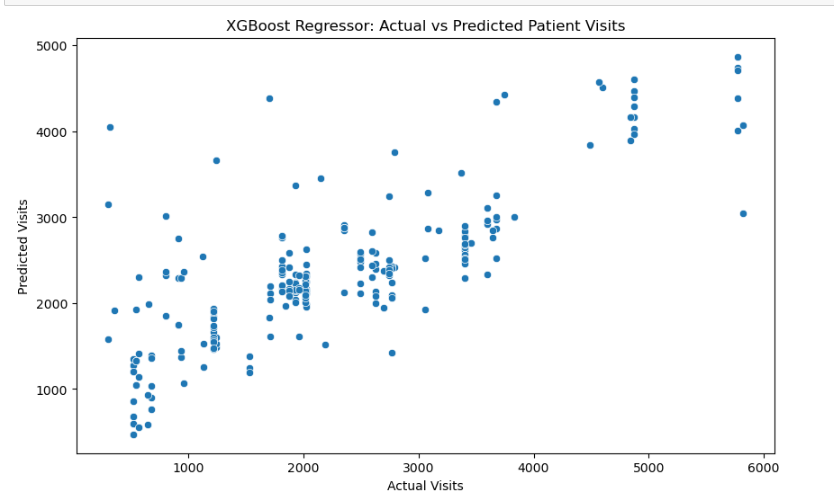
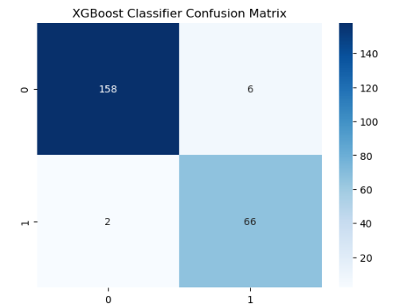

# 🏥 Patient Surge Forecasting for Primary Health Centres (PHCs)

## 📘 Overview
This project builds a **machine learning pipeline** to forecast patient surges across Primary Health Centres (PHCs) in Nigeria.  
The goal is to help health planners and policymakers **anticipate capacity overloads**, **allocate staff more efficiently**, and **improve service readiness**.  

Using **XGBoost Regressor** and **XGBoost Classifier**, the project predicts:
1. The **expected number of patient visits** for the next month per facility.  
2. Whether a facility will **exceed its operational capacity** (*overload flag*).

---

## 🎯 Objectives
- Predict monthly patient inflows for each PHC.  
- Identify facilities likely to experience overload.  
- Support decision-making for human resource and logistics planning.

---

## 🧩 Data Sources
The dataset integrates information from four key sources:

| Source | Description |
|--------|--------------|
| 📘 Disease Incidence / Service Data | Total visits, disease cases, delivery counts |
| 📗 Population Distribution | Catchment population for each PHC |
| 📙 Health Worker Distribution | Number of doctors, nurses, CHEWs per facility |
| 📒 Travel Time Data | Travel time (in minutes) to the nearest secondary facility |

Each record represents a **PHC-month snapshot**.

---

## 🧠 Feature Engineering
Key derived indicators used for model training:

| Feature | Description |
|----------|--------------|
| `visits_per_staff` | Ratio of patient visits to total staff |
| `visits_per_1000_pop` | Visits per 1,000 population in the PHC catchment |
| `disease_ratio` | Share of disease-related cases relative to total visits |

These features quantify **facility workload** and **population-service relationships**.

---

## ⚙️ Models Trained
Four models were trained and benchmarked:

| Model | Type | Purpose |
|--------|------|----------|
| Prophet | Time-Series | Trend forecasting baseline |
| Random Forest Regressor | Regression | Volume estimation baseline |
| XGBoost Regressor | Regression | Predicts monthly patient visits |
| XGBoost Classifier | Classification | Predicts overload flag (Yes/No) |

### ✅ Best Performers
- **XGBoost Regressor** → R² = **0.66**, RMSE ≈ **845**, MAE ≈ **529**  
- **XGBoost Classifier** → Accuracy = **97.6%**

---

## 📈 Results Summary

| Metric | XGBoost Regressor | XGBoost Classifier |
|---------|------------------|--------------------|
| R² | 0.66 | — |
| RMSE | 844.7 | — |
| MAE | 529.0 | — |
| Accuracy | — | 97.6% |
| Precision | — | 0.98 |
| Recall | — | 0.98 |

---

## 📊 Visual Outputs
### 1️⃣ Actual vs Predicted Patient Visits
A scatter plot comparing real and predicted patient volumes.



```
plt.figure(figsize=(10,6))
sns.scatterplot(x=y_test_reg, y=y_pred_reg)
plt.xlabel("Actual Visits")
plt.ylabel("Predicted Visits")
plt.title("XGBoost Regressor: Actual vs Predicted Patient Visits")
plt.show()
```


### 2️⃣ Confusion Matrix
Visualizing model performance in detecting overloads.



```
sns.heatmap(confusion_matrix(y_test_clf, y_pred_clf), annot=True, fmt='d', cmap='Blues')
plt.title("XGBoost Classifier Confusion Matrix")
plt.show()
```

---

## 🧮 Tools & Technologies
- **Python** – data wrangling, modeling, and visualization  
- **Pandas / NumPy** – data processing  
- **Matplotlib / Seaborn** – charts and model visualization  
- **Scikit-learn** – preprocessing and evaluation metrics  
- **XGBoost** – regression and classification models  
- **Jupyter Notebook / Google Colab** – experimentation and collaboration  

---

## 💾 Model Saving
The best models were serialized using `joblib` for reuse:
```
import joblib
joblib.dump(xgb_reg, 'xgb_regressor_model.pkl')
joblib.dump(xgb_clf, 'xgb_classifier_model.pkl')
```
## 📂 Output Format

The final output file **`phc_forecast_predictions.csv`** contains the following columns and descriptions:

| **Column**           | **Description**                      |
| -------------------- | ------------------------------------ |
| `facility_name`      | PHC name                             |
| `lga`                | Local Government Area                |
| `month`              | Month of observation                 |
| `forecast_month`     | Predicted future month               |
| `predicted_visits`   | Forecasted total visits              |
| `overload_flag_pred` | Overload indicator (1 = yes, 0 = no) |

**Example:**

| facility_name         | lga  | month      | forecast_month | predicted_visits | overload_flag_pred |
| --------------------- | ---- | ---------- | -------------- | ---------------- | ------------------ |
| Tamus Ngamdaa Clinic  | Jere | 12/10/2024 | 1/1/2025       | 2874.96          | 0                  |
| Gongu Along Model PHC | Jere | 12/10/2024 | 1/1/2025       | 2414.97          | 0                  |

